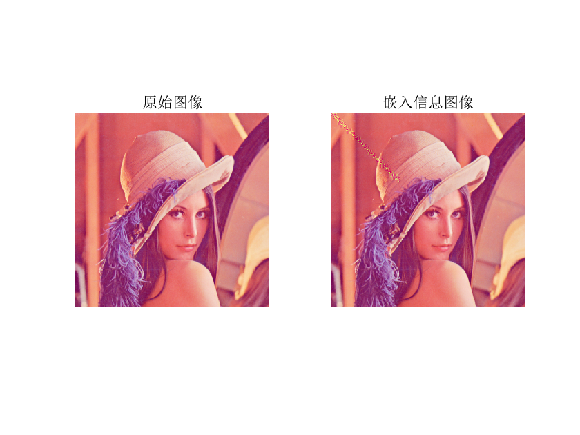

# 信息隐藏第五次实验
**1410658 杨旭东**
## 1. DCT 域的信息隐藏
- 图像压缩标准（JPEG）的核心——二维 DCT 变换。
- 在 DCT 域中的信息隐藏，可以有效地抵抗 JPEG 有损压缩。 
## 2. 基本隐藏算法
以一定的方式挑选一些中频系数，在这些中频系数中叠加秘密信息：

- 所有中频系数
- 固定位置的中频系数
- 随机挑选中频系数
- 选择最大的几个中频系数
### 2.1. 算法一
在选出的中频系数中叠加秘密信息：
```
x'(i,j)=x(i,j)+ami
```
>x(i,j) ： DCT系数<br>
>x'(i,j) ： 隐藏后的 DCT 系数<br>
>mi ： 第 i 个秘密信息比特<br>
>a ： 可调参数，控制嵌入强度<br>
### 2.2. 算法二
在选出的中频系数中叠加秘密信息：
```
x'(i,j)=x(i,j)(1+ami)
```
>方法一：每个系数上嵌入的强度相同<br>
>方法二：根据系数的大小，成比例地嵌入，是对方法一的改进<br>
>缺点：此两算法的提取需要原始图像<br>
### 2.3. 算法三
不需要原始载体的信息隐藏方法：利用载体中两个特定数的相对大小来代表隐藏的信息。
#### 2.3.1. 嵌入
载体图像分为 8 × 8 的块，做二维 DCT 变换，伪随机地选择一个图像块 Bi ，分别选择其中的两个位置，比如用 (u1,v1) 和 (u2,v2) 代表所选定的两个系数的坐标：

- 如果 Bi(u1,v1)>Bi(u2,v2) ，代表隐藏 1 ；如果相反，则交换两系数。
- 如果 Bi(u1,v1)<Bi(u2,v2) ，代表隐藏 0 ；如果相反，则交换两系数。
#### 2.3.2. 提取
接收者进行二维 DCT 变换，比较每一块中约定位置的 DCT 系数值，根据其相对大小，得到隐藏信息的比特串，从而恢复出秘密信息。
>特点：不需原始图像。<br>
>注意：如果选定位置的两个系数相差太大，则对图像影响较大。应选择相近的值（如中频系数）。
### 2.4. 算法四
算法三的扩展：利用DCT中频系数中的三个系数之间的相对关系来对秘密信息进行编码。
#### 2.4.1. 嵌入
选择三个位置 (u1,v1) ， (u2,v2) ， (u3,v3) ：

- 嵌入 1：令 Bi(u1,v1)>Bi(u3,v3)+D ， Bi(u2,v2)>Bi(u3,v3)+D 。
- 嵌入 0：令 Bi(u1,v1)<Bi(u3,v3)-D ， Bi(u2,v2)<Bi(u3,v3)-D 。
- 如果数据不符，则修改这三个系数值，使得它们满足上述关系。
>其中参数 D 的选择要考虑隐藏的健壮性和不可察觉性之间的平衡，D 越大，隐藏算法对于图像处理就越健壮，但是对图像的改动就越大，越容易引起察觉。
- 如果需要做的修改太大，则放弃该块，将其标识为“无效”。
>“无效”：对这三个系数做小量的修改使得它们满足下面条件之一：<br>
Bi(u1,v1)≤Bi(u3,v3)≤Bi(u2,v2) 或 Bi(u1,v1)≥Bi(u3,v3)≥Bi(u2,v2)
#### 2.4.2. 提取
对图像进行 DCT 变换，比较每一块相应三个位置的系数，从它们之间的关系，可以判断隐藏的是信息“1”、“0”还是“无效”块，这样就可以恢复秘密信息。
## 3. 代码实现与解释
使用 MATLAB 实现了第三个算法，即 `2.3.` 中的利用利用载体中两个特定数的相对大小来代表隐藏信息的方法，不需要原始载体的信息，用 decode.m 实现秘密信息嵌入，用 encode.m 实现秘密信息提取，字符串处理的函数与上一个实验使用的是一样的，目的是将字符串编码为二进制比特流，或者将二进制比特流解码为字符串。
### 3.1. encode.m
```MATLAB
clear;
msgfid=fopen('隐藏信息.txt','r');%打开秘密文件,读入秘密信息
[msg,count]=fread(msgfid);
fclose(msgfid);
msg=str2bit(msg);
ends=[0,0,0,0,0,0,0,0];%结尾标记
msg=[msg,ends];
msg=msg';
[len col]=size(msg);

%读取载体图像进行DCT变换
io=imread('载体图片.bmp');
io=double(io)/255;
output=io;
i1=io(:,:,2);%取图像的第二层来隐藏
T=dctmtx(8);%对图像进行分块
DCTrgb=blkproc(i1,[8 8],'P1*x*P2',T,T');%对图像分块进行DCT变换
[row,col]=size(DCTrgb);
row=floor(row/8);
col=floor(col/8);

%顺序信息嵌入
count=count*8+8;%需要加上结尾信息长度
alpha=0.03;%Alpha系数用于控制差值大小
temp=0;
for i=1:count;
    if msg(i,1)==0
        if DCTrgb(i+2,i+1)<DCTrgb(i+3,i+6) %选择(3,2)和(4,7)这一对系数
            temp=DCTrgb(i+2,i+1);
            DCTrgb(i+2,i+1)=DCTrgb(i+3,i+6);
            DCTrgb(i+3,i+6)=temp;
        end
    else
        if  DCTrgb(i+2,i+1)>DCTrgb(i+3,i+6)
            temp=DCTrgb(i+2,i+1);
            DCTrgb(i+2,i+1)=DCTrgb(i+3,i+6);
            DCTrgb(i+3,i+6)=temp;
        end
    end
    if DCTrgb(i+2,i+1)<DCTrgb(i+3,i+6)
        DCTrgb(i+2,i+1)=DCTrgb(i+2,i+1)-alpha;%将原本小的系数调整更小，使得系数差别变大
    else
        DCTrgb(i+3,i+6)=DCTrgb(i+3,i+6)-alpha;
    end
end

%将信息写回并保存
wi=blkproc(DCTrgb,[8 8],'P1*x*P2',T',T);%对DCTrgb进行逆变换
output=io;
output(:,:,2)=wi;
imwrite(output,'载体图片_隐藏信息.bmp');

%显示结果对比
figure;
subplot(1,2,1);imshow('载体图片.bmp');title('原始图像');
subplot(1,2,2);imshow('载体图片_隐藏信息.bmp');title('嵌入信息图像');
```
首先对需要嵌入的信息做一个预处理，加上一个结尾标记，目的是方便解码时能够正确的提取需要的信息，去除掉冗余信息。然后彩色图片有 RGB 三层信息，只需要一层来隐藏信息即可，这里取的是第二层来做 DCT 变换隐藏信息。嵌入信息过程中 Alpha 系数用于控制差值大小，将两个系数的差值放大，可以保证提取信息的正确性，但是过大会暴露出载体图片的变化。接下来会做一个对比。
### 3.2. decode.m
```MATLAB
clear;
wi=imread('载体图片_隐藏信息.bmp');%读取携密图像
wi=double(wi)/255;
wi=wi(:,:,2);%取图像的第二层来提取
T=dctmtx(8);%对图像进行分块
DCTcheck=blkproc(wi,[8 8],'P1*x*P2',T,T');%对图像分块进行DCT变换

%提取信息
for i=1:256 %256为隐藏的秘密信息的比特数
     if  DCTcheck(i+2,i+1)<=DCTcheck(i+3,i+6)        
         message(i)=1;
     else
         message(i)=0;
     end
end

%对信息进行处理，过滤掉其他信息
ends=[0,0,0,0,0,0,0,0];%结尾标记
l=0;
for i=1:8:256 %因为每个字符编码为8位，所以间隔为8
     if  message(i:i+7)==ends
         l=i-1;
     end
end
message0=message(1:l);

%将提取信息写入文件保存
out=bit2str(message0');
fid=fopen('提取信息.txt', 'wt');
fwrite(fid, out);
fclose(fid);
```
提取同样是从 RGB 图片的第二层提取，需要做的特殊处理的是将结尾标记之后的信息去掉，就能得到隐藏信息。
## 4. 实验结果展示
实验中， Alpha 系数是可变的，接下来对比一下改变它的效果，以确定一个合适的值。
### 4.1. Alpha = 0.03
<br>
### 4.2. Alpha = 0.1
<br>
### 4.3. Alpha = 0.5
<br>
### 4.4. Alpha = 1
<br>
>从图中可以看出，Alpha = 0.1 时就已经隐约能看到对角线上有痕迹，0.5 和 1 时都特别明显，所以实验中我还是选择了比较小的 0.03 来作为差值。最终结果见 `载体图片_隐藏信息.bmp`
### 4.5. 待隐藏秘密信息
>隐藏信息.txt
```txt
信息安全1410658杨旭东
```
### 4.6. 从图片提取的秘密信息
>提取信息.txt
```txt
信息安全1410658杨旭东
```
可以看出信息能够完美提取出来。